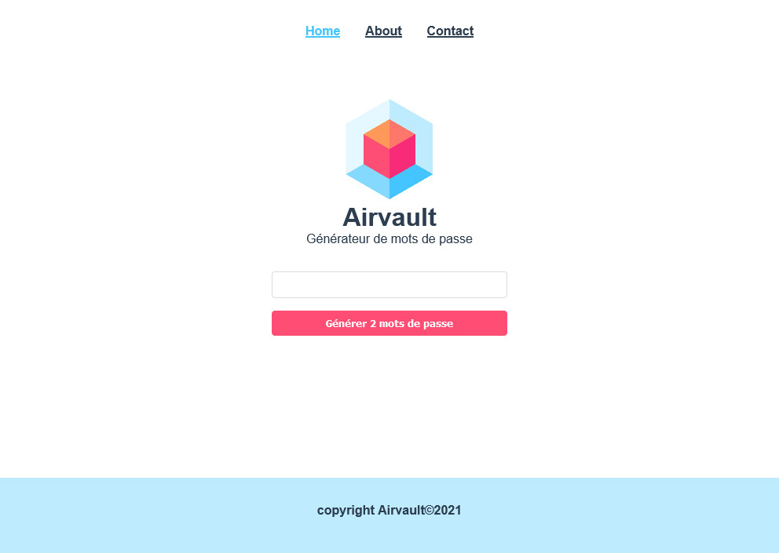

### Live version [here](https://vue-airvault.vercel.app/#/).

# Airvault

## Détails

> Technos utilisées : HTML/CSS/JS/Vue.js

Pour ce projet mon objectif était de réaliser le front d'un gestionnaire de mot de passe initié par un collègue développeur backend. La réalisation d'une API était en cours et il a souhaité me déléguer la création de l'interface en Vue.js.
Cette application simple m'a permit de réaliser un premier projet dans cette techno. Le lien vers l'API n'est pas encore faisable pour le moment et fera l'objet d'une prochaine itération.  
